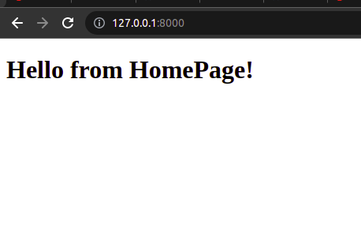
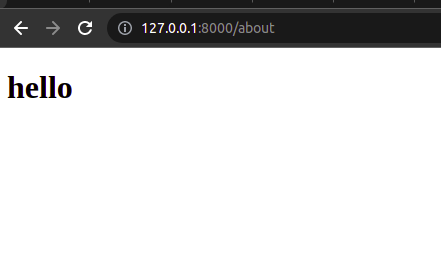

# django-snacks

# [Pull Request Link ](https://github.com/GhaidaMomani/django-snacks/pull/1)

#  web site in Django with 2 pages
**home page**
**about page**

used ancestor template to contain navigation elements
It is built the “Django way” aka match the structure of in-class demo

    
(<a href="#top">back to top</a>)

  

Ghaida Al Momani, Software Engineer

Jordan, Amman

  
22, 9 MAY
